# Background

Before diving into performing complex analyses with the BEAST2 one needs to understand the basic workflow and concepts. While BEAST2 tries to be as user-friendly as possible, the amount of possibilities can be overwhelming.

In this simple tutorial you will get acquainted with the basic workflow of BEAST2 and the software tools most commonly used to interpret the results of the analyses. Bear in mind that this tutorial is designed just to help you get started using BEAST2. This tutorial does not discuss all the choices and concepts in detail, as they are discussed in further  tutorials.

----

# Programs used in this Exercise 

### BEAST2 - Bayesian Evolutionary Analysis Sampling Trees 2

BEAST2 ([http://www.beast2.org](http://www.beast2.org)) is a free software package for Bayesian evolutionary analysis of molecular sequences using MCMC and strictly oriented toward inference using rooted, time-measured phylogenetic trees. This tutorial is written for BEAST v{{ page.beastversion }} . 

### BEAUti2 - Bayesian Evolutionary Analysis Utility

BEAUti2 is a graphical user interface tool for generating BEAST2 XML configuration files.

Both BEAST2 and BEAUti2 are Java programs, which means that the exact same code runs on all platforms. For us it simply means that the interface will be the same on all platforms. The screenshots used in this tutorial are taken on a Mac OS X computer; however, both programs will have the same layout and functionality on both Windows and Linux. BEAUti2 is provided as a part of the BEAST2 package so you do not need to install it separately.

### TreeAnnotator

TreeAnnotator is used to summarise the posterior sample of trees to produce a maximum clade credibility tree. It can also be used to summarise and visualise the posterior estimates of other tree parameters (e.g. node height).

TreeAnnotator is provided as a part of the BEAST2 package so you do not need to install it separately.

### Tracer

Tracer ([http://beast.community/tracer](http://beast.community/tracer)) is used to summarise the posterior estimates of the various parameters sampled by the Markov Chain. This program can be used for visual inspection and to assess convergence. It helps to quickly view median estimates and 95% highest posterior density intervals of the parameters, and calculates the effective sample sizes (ESS) of parameters. It can also be used to investigate potential parameter correlations. We will be using Tracer v{{ page.tracerversion }}.

### FigTree

FigTree ([http://beast.community/figtree](http://beast.community/figtree)) is a program for viewing trees and producing publication-quality figures. It can interpret the node-annotations created on the summary trees by TreeAnnotator, allowing the user to display node-based statistics (e.g. posterior probabilities). We will be using FigTree v{{ page.figtreeversion }}.

### DensiTree

Bayesian analysis using BEAST2 provides an estimate of the uncertainty in tree space. This distribution is represented by a set of trees, which can be rather large and difficult to interpret. DensiTree is a program for qualitative analysis of sets of trees. DensiTree allows to quickly get an impression of properties of the tree set such as well-supported clades, distribution of tree heights and areas of topological uncertainty.

DensiTree is provided as a part of the BEAST2 package so you do not need to install it separately.

----

# Practical: Running a simple analysis with BEAST2

This tutorial will guide you through the analysis of an alignment of sequences sampled from twelve primate species. The aim of this tutorial is to co-estimate the following:

1. The gene phylogeny;
2. The rate of evolution on each lineage based on divergence times of their host species.

More generally, this tutorial aims to introduce new users to a basic workflow and point out the steps towards performing a full analysis of sequencing data within a Bayesian framework.

## The Data

Before we can start, we need to download the input data for the tutorial. For this tutorial we use a single NEXUS file, `primate-mtDNA.nex`, which contains a sequence alignment and metadata of the twelve primate mitochondrial genomes which we will be analysing. Among other information the metadata contains information to partition the alignment into 4 regions:

- Non-coding region
- 1st codon positions
- 2nd codon positions
- 3rd codon positions

The alignment file can be downloaded from the Taming the BEAST website at [https://taming-the-beast.org/tutorials/Introduction-to-BEAST2/](https://taming-the-beast.org/tutorials/Introduction-to-BEAST2/) or from Github.

> **Downloading from taming-the-beast.org**
> 
> A link to the alignment file, `primate-mtDNA.nex`, is on the left-hand panel, under the heading **Data**.
> **Right-click** on the link and select **"Save Link As..."** (Firefox and Chrome) or **"Download Linked File As..."** (Safari) and save the file to a convenient location on your local drive. Note that some browsers will automatically change the extension of the file from `.nex` to `.nex.txt`. If this is the case simply rename the file again. 
>
> Alternatively, if you **left-click** on the link most browsers will display the alignment file. You can then press **File > Save As** to store a local copy of the file. Note that some browsers will inject an HTML header into the file, which will make it unusable in BEAST2 (making this the less preferable option for downloading data files).
>
> In the same way you can also download example `.xml` files for the analyses in this tutorial, as well as _pre-cooked_ output `.log` and `.trees` files. We recommend only downloading these files to check your results or if you become seriously stuck.
>

 

> **Downloading from Github**
>
> If you navigate to the Github repository you can either download the raw data files directly from **Github** or clone/download the repository to your local drive.
>
> Note that this tutorial is distributed under a **CC BY 4.0** license, which gives anyone the right to freely use (and modify) it, as long as appropriate credit is given and the updated material is licensed in the same fashion.
>

## Creating the Analysis File with BEAUti

To run analyses with BEAST, one needs to prepare a configuration file in XML format that contains everything BEAST2 needs to run an analysis. A BEAST2 XML file contains: 

- The data (typically a sequence alignment)
- The model specification
- Initial values and parameter constraints
- Settings of the MCMC algorithm
- Output options

Even though it is possible to create such files by hand from scratch, it can be complicated and is not exactly straightforward. BEAUti is a user-friendly program designed to aid you in producing a valid setup file for BEAST. If necessary that file can later be edited by hand, but it is recommended to use BEAUti for generating the files at least for the initial round of analysis.

> Begin by starting **BEAUti2**.

### Importing the alignment

To give BEAST2 access to the data, the alignment ha to be added to the configuration file. 

> Drag and drop the file `primate-mtDNA.nex` into the open BEAUti window (it should be on the **Partitions** tab). 
>
> Alternatively, use **File > Import Alignment** or click on the **+** in the bottom left-hand corner of the window, then locate and click on the alignment file.
>

Once you have done that, the data should appear in the BEAUti window which should look as shown in [Figure 1](#fig:data).

<figure>
	
	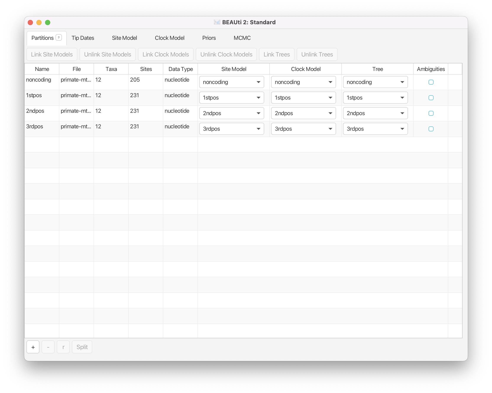
	<figcaption>Figure 1: Data imported into BEAUti2.</figcaption>
</figure>
 

### Setting up shared models

A common way to account for site-to-site rate heterogeneity (variation in substitution rates between different sites) is to use a Gamma site model. In this model, one assumes that rate variation follows a Gamma distribution. To make the analysis tractable the Gamma distribution is discretised to a small number of bins (4-6 usually). The mean of each bin then acts as a multiplier for the overall substitution rate. The transition probabilities are then calculated for each scaled substitution rate. To calculate the likelihood for a site, **P(data | tree, substitution model)** is calculated under each Gamma rate category and the results are summed up to average over all possible rates. This is a handy approach if one suspects that some sites are mutating faster than others but the precise position of these sites in the alignment is unknown or random.

Another way to account for site-to-site rate heterogeneity is to split the alignment into explicit partitions, and specify an independent substitution model for each partition. This is especially relevant, when one knows exactly which positions in the alignment have different substitution rates from the rest of the sites. In our example, we split the alignment into coding and non-coding regions, and further split the coding region into 1st, 2nd and 3rd codon positions. This information is encoded as metadata into the `.nex` file, which BEAUti automatically processes to produce the four partitions shown in the **Partitions** tab as shown in [Figure 1](#fig:data).

> **Double-click** on the different partitions (under the **File** column) to view the alignments.
>

<figure>
	
	
	<figcaption>Figure 2: The partition for the 2nd codon positions in the coding region of the primate mtDNA alignment.</figcaption>
</figure>

<figure>
	
	
	<figcaption>Figure 3: The partition for the 3rd codon positions in the coding region of the primate mtDNA alignment.</figcaption>
</figure>
 

By looking at the alignments for the 2nd and 3rd codon positions [Figure 2](#fig:2ndpos) and [Figure 3](#fig:3rdpos) we can immediately see a clear difference between the two codon positions. For the 2nd codon position many of the ancestral relationships are clear from shared substitutions between groups, for instance between the great apes (_Homo sapiens_, _Pan_, _Gorilla_ and _Pongo_ - humans, chimpanzees, gorillas and orangutans) and between the old-world monkeys (_Macaca fuscata_, _M. mulatta_, _M. fascicularis_ and _M. sylvanus_ - the macaques). The lesser apes (represented by _Hylobates_ - gibbons) share most substitutions with the great apes, but occasionally share a substitution with the macaques. For the 3rd codon position there are many more substitutions and the groupings are not as clear. 

> **Topic for discussion:** Do you think there is a good case for using independent substitution models on the different partitions in the `.nex` file? Do you think this is sufficient for taking all site-to-site rate variation into account? How would you account for rate variation between sites in each partition? 
>

Since all of the sequences in this dataset are from the mitochondrial genome (which is not believed to undergo recombination in birds and mammals) they all share the same ancestry. By default BEAST2 would recover a separate, independent time-tree for each partition, so we need to make sure that it uses all data to recover only a single shared tree. For the sake of simplicity, we will also assume that the partitions have the same evolutionary branch-rate distribution, and hence share the clock model as well.

To make sure that the partitions share the same evolutionary history we need to link the **clock model** and the **tree** in BEAUti.

> Select all four data partitions the **Partitions** panel (use **shift+click**) and click the **Link Trees** and **Link Clock Models** buttons.

You will see that the **Clock Model** and the **Tree** columns in the table both changed to say `noncoding`. Now we will rename both models such that the following options and generated log files more easy to read. The resulting setup should look as shown in [Figure 4](#fig:link).

> Click on the first drop-down menu in the **Clock Model** column and rename the shared clock model to `clock`.
>
> Likewise, rename the shared tree to `tree`.

<figure>
	
	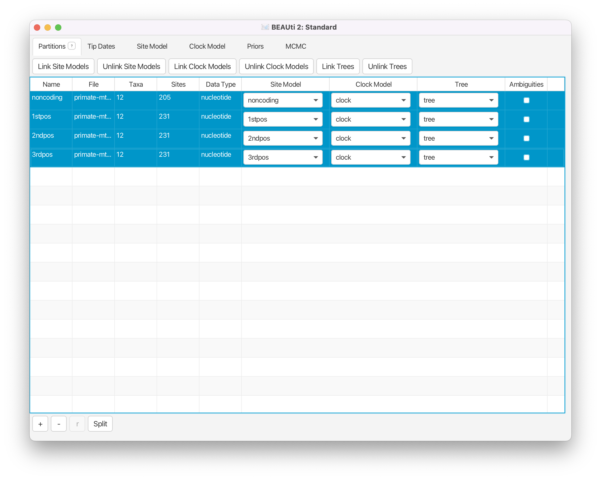
	<figcaption>Figure 4: Linked models.</figcaption>
</figure>
 

### Setting the substitution model

In this analysis all of our sequences come from extant species and were thus all sampled in the present (assumed to be ). Therefore we do not need to set up sampling dates and we skip the **Tip Dates** panel. Next we need to set up the substitution model in the **Site Model** tab.

> Select the **Site Model** tab.

The options available in this panel depend on whether the alignment data are in nucleotides, amino-acids, binary data or general data. The settings available after loading the alignment will contain the default values which we normally want to modify.

The panel on the left shows each partition. Remember that we did not link the substitution models in the previous step for the different partitions, so each partition evolves under a different substitution model, i.e. we assume that different positions in the alignment accumulate substitutions differently. We will need to set the site substitution model separately for each part of the alignment as these models are unlinked. However, we think that all partitions evolve according to the same model (although with different parameters).

> Make sure that `noncoding` is selected. 
>
> - Check the **estimate** checkbox for **Substitution Rate**.
> - Set the **Gamma Category Count** to 4.
> - Check the **estimate** box for the **Shape** parameter (it should already be checked).
> - Select **HKY** in the **Subst Model** drop-down menu.
> - Select **Empirical** from the **Frequencies** drop-down menu.
>
> Note that when you checked **estimate** for the substitution rate a yellow circle with a cross appeared to the right of **Fix mean substitution rate**. If you hover your cursor above the circle you will see a warning. **Ignore** the warning and continue with the next step.
>

<figure>	
	
	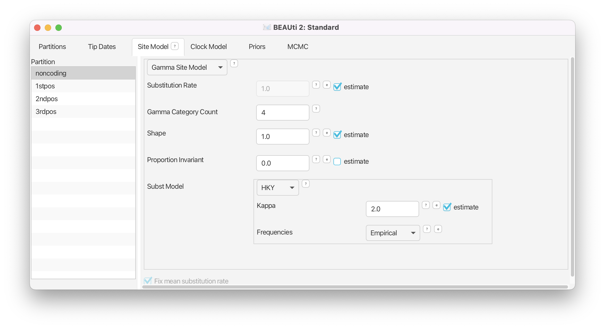
	<figcaption>Figure 5: Substitution model setup.</figcaption>
</figure>
 

The panel should look like [Figure 5](#fig:subst). We are using an HKY substitution model with empirical frequencies. This will fix the frequencies to the proportions observed in the partition. This approach means that we can get a good fit to the data without explicitly estimating these parameters. To model site-to-site rate variation within the partition we use a discrete Gamma site model with 4 categories. Now we _could_ repeat the above steps for each of the remaining partitions or we can take a shortcut.

> Select the remaining three partitions (use **shift+click**). The window will now look like [Figure 6](#fig:clone). 
>
> Click **OK** to to clone the site model for the other three partitions from `noncoding`.

<figure>	
	
	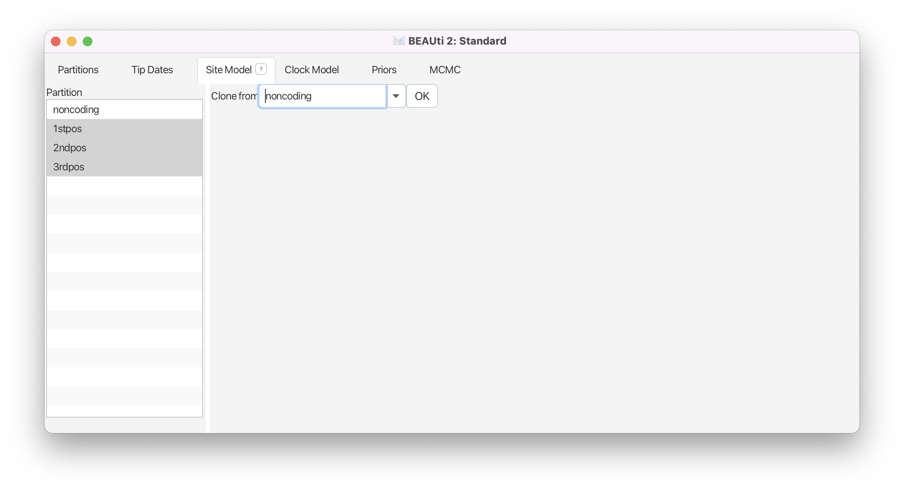
	<figcaption>Figure 6: Shortcut to clone site models between partitions.</figcaption>
</figure>
 

If you did everything correctly the yellow circle with a cross to the right of **Fix mean substitution rate** would have disappeared. 

> **Topic for discussion:** Can you figure out the reason for the warning when you checked **estimate** for the substitution rate?
> Don't worry if you can't figure it out, the reason for the warning is explained in detail in later tutorials.
>

### Setting the clock model

Next, select the **Clock Model** tab at the top of the main window. This is where we set up the molecular clock model. For this exercise we are going to leave the selection at the default value of a strict molecular clock, because this data is very clock-like and does not need rate variation among branches to be included in the model.

> Click on the **Clock Models** tab and view the setup _(but don't do anything)_.

### Setting priors

The **Priors** tab allows prior distributions to be specified for each model parameter. The model selections made in the **Site Model** and **Clock Model** tabs determine which parameters are included in the model. For each of these parameters a prior distribution needs to be specified. It is also possible to specify hyperpriors (and hyper-hyperpriors etc.) for each of the model parameters.

Here we specify that we wish to use the Calibrated Yule model as the tree prior. This is a simple model of speciation that is generally more appropriate when considering sequences from different species.

> Go to the **Priors** tab and select **Calibrated Yule Model** in the drop-down menu next to **Tree.t:tree**.

The **birthRate** parameter measures the rate of speciation in the calibrated Yule model. We will set an unspecific Gamma prior for this parameter.

> For **birthRateY.t:tree** select **Gamma** from the drop-down menu
>
> - Expand the options for **birthRateY.t:tree** using the arrow button on the left.
> - Set the **Alpha** (shape) parameter to **0.001** and the **Beta** (scale) parameter to **1000**.
>

Note that BEAUti displays a plot of the prior distribution on the right, as well as a few of its quantiles. This is for easy reference and can help us decide if a prior is appropriate. The unspecific Gamma prior we are using is defined on  and has a very broad range of values included between its 2.5% and 97.5% quantiles. 

If we wanted to add a hyperprior on one of the parameters of the Gamma prior we would check the **estimate** box on the right of the parameter. We could also change the initial values or limits of the model parameters by clicking on the boxes next to the drop-down menus. Do **not** do this here, as we are **not** adding any hyperpriors or changing limits in this analysis! 

**We will leave the rest of the priors on their default values!** The BEAUti panel should look as shown in [Figure 7](#fig:priors).

Please note that in general using default priors is highly frowned upon as priors are meant to convey your prior knowledge of the parameters. It is important to know what information the priors add to the MCMC analysis and whether this fits your particular situation. In our case the default priors are suitable for this particular analysis, however for further, more complex analyses, we will require a clear idea of what the priors mean. Getting this understanding is difficult and comes with experience. The topic of choosing priors is discussed in more detail in later tutorials.

<figure>
	
	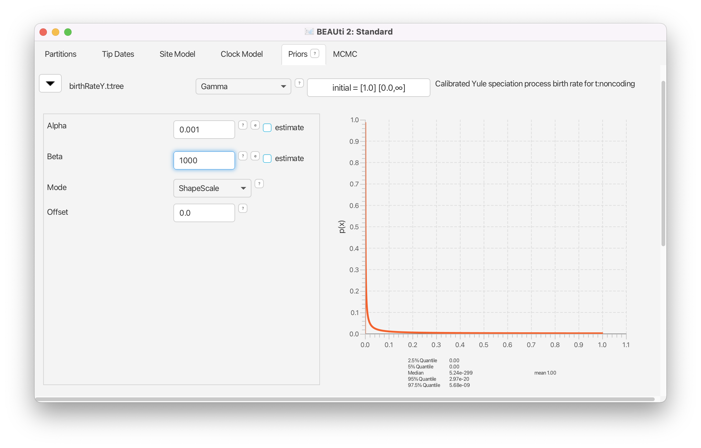
	<figcaption>Figure 7: Prior setup.</figcaption>
</figure>
 

### Adding a calibration node

Since all of the samples come from a single time point, there is no information on the actual height of the phylogenetic tree in time units. The tree height (tMRCA) and substitution rate parameters will not be distinguishable and BEAST2 will only be able to estimate their product. To give BEAST2 the possibility to separate these two parameters we need to input additional information that will help calibrate the tree in time.

In a Bayesian analysis additional information from external sources should be encoded in the form of a prior distribution. Thus, we will have to add a new prior to the model that is not yet defined. 

> To add an extra prior to the model, press the **+ Add Prior** button below list of priors and select **MRCA Prior** from the drop-down menu.
>
> You will see a dialogue box that allows you to select a subset of taxa from the phylogenetic tree. Once you have created a taxon set you will be able to add calibration information for its most recent common ancestor (MRCA) later on.
> 
> - Set the **Taxon set label** to `human-chimp`.
> - Locate `Homo_sapiens` in the left hand side list and click the **>>** button to add it to the `human-chimp` taxon set.
> - Locate `Pan` in the left hand side list and click the **>>** button to add it to the `human-chimp` taxon set.

The taxon set should now look like [Figure 8](#fig:taxa).

> Click the **OK** button to add the newly defined taxon set to the prior list.
>

<figure>
	
	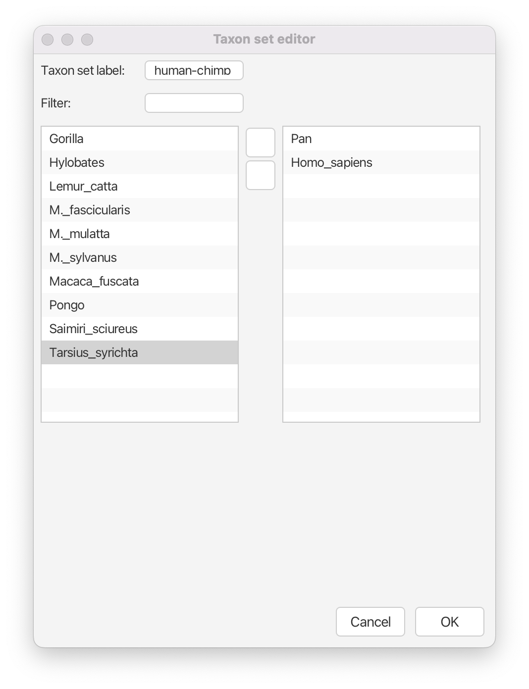
	<figcaption>Figure 8: Calibration node taxa set definition.</figcaption>
</figure>
 

The new node we have added is a calibrated node on the human-chimpanzee split to be used in conjunction with the Calibrated Yule prior. In order for that to work we need to enforce monophyly. This will constrain the tree topology so that the human-chimp grouping is kept monophyletic during the course of the MCMC analysis.

> Check the **monophyletic** checkbox next to **human-chimp.prior**.

We now need to specify a prior distribution on the calibration node based on our prior fossil knowledge in order to calibrate our tree. We will use a Normal distribution with mean 6 MYA and a standard deviation of 0.5 million years. This will give a central 95% range of about 5-7 million years, which roughly corresponds to the current consensus estimate of the date of the most recent common ancestor of humans and chimpanzees.

> Select **Normal** from the drop-down menu to the right of the newly added **human-chimp.prior**.
>
> - Expand the distribution options using the arrow button on the left.
> - Set the **Mean** of the distribution to **6**.
> - Set the **Sigma** of the distribution to **0.5**.

The final setup of the calibration node should look as shown in [Figure 9](#fig:calibration).

<figure>
	
	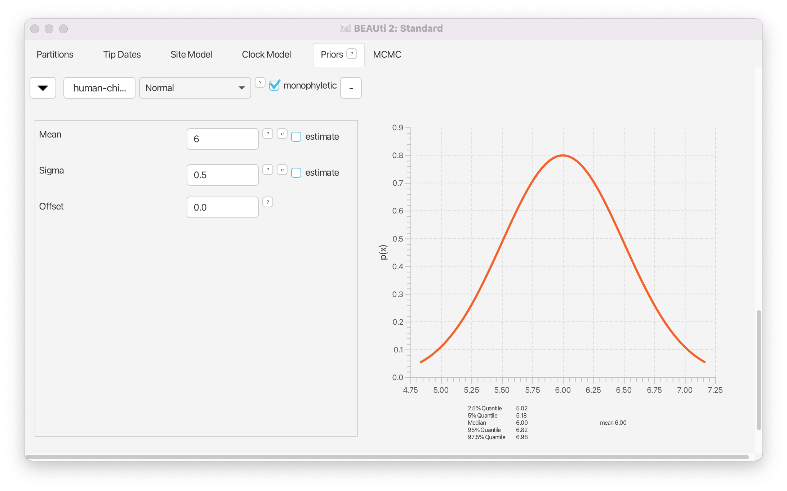
	<figcaption>Figure 9: Calibration node prior setup.</figcaption>
</figure>

### Setting the MCMC options

Finally, the **MCMC** tab allows to control the length of the MCMC chain and the frequency of stored samples. It also allows one to change the output file names.

> Go to the **MCMC** tab.

The **Chain Length** parameter specifies the number of steps the MCMC chain will make before finishing (i.e. the number of accepted proposals). This number depends on the size of the dataset, the complexity of the model and the precision of the answer required. The default value of 10'000'000 is arbitrary and should be adjusted accordingly. For this small dataset we initially set the chain length to 1'000'000 such that this analysis will take only a few minutes on most modern computers (rather than hours). We leave the **Store Every** and **Pre Burnin** fields at their default values.

> Set the **Chain Length** to 1'000'000.

Below these general settings you will find the logging settings. Each particular option can be viewed in detail by clicking the arrow to the left of it. You can control the names of the log files and how often values will be stored in each of the files.

Start by expanding the **tracelog** options. This is the log file you will use later to analyse and summarise the results of the run. The **Log Every** parameter for the log file should be set relative to the total length of the chain. Sampling too often will result in very large files with little extra benefit in terms of the accuracy of the analysis. Sampling too rarely will mean that the log file will not record sufficient information about the distributions of the parameters. We normally want to aim to store no more than 10'000 samples so this should be set to no less than chain length/10'000. For this analysis we will make BEAST2 write to log file every 200 samples.

> Expand the **tracelog** options.
> 
> - Set the **Log Every** parameter to **200**.
> - Leave the filename as is
>

Next, expand the **screenlog** options. The screen output is simply for monitoring the program's progress. Since it is not so important, especially if you run your analysis on a remote computer or a computer cluster, the **Log Every** can be set to any value. However, if it is set too small, the sheer quantity of information being displayed on the screen will actually slow the program down. For this analysis we will make BEAST2 log to screen every 1'000 samples, which is the default setting.

> Expand the **screenlog** options.
>
> - Leave the **Log Every** parameter at the default value of 1'000.

Finally, we can also change the tree logging frequency by expanding **treelog.t:tree**. For big trees with many taxa each individual tree will already be quite large, thus if you log lots of trees the tree files can easily become extremely large. You will be amazed at how quickly BEAST can fill up even the biggest of drives if the tree logging frequency is too high! For this reason it is often a good idea to set the tree logging frequency lower than the trace log (especially for analyses with many taxa). However, be careful, as the post-processing steps of some models (such as the Bayesian skyline plot) require the trace and tree logging frequencies to be identical!

> Expand the **treelog.t:tree** options.
>
> - Set the **File Name** to `primate-mtDNA.trees`.
> - Leave the **Log Every** parameter at the default value of 1'000.

The final setup should look as in [Figure 10](#fig:logs).

<figure>
	
	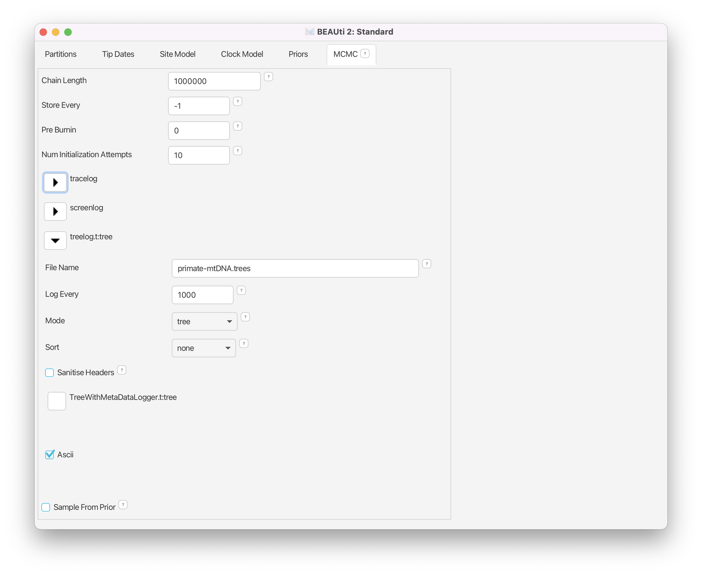
	<figcaption>Figure 10: Logging options.</figcaption>
</figure>

### Generating the XML file

We are now ready to create the BEAST2 XML file. This is the final configuration file BEAST2 can use to execute the analysis.

> Save the XML file under the name `Primates.xml` using **File > Save**.

 

----

## Running the analysis

Now run BEAST2 and provide your newly created XML file as input. You can also change the **random number seed** for the run. This number is the starting point of a pseudo-random number chain BEAST2 will use to generate the samples. As computers are unable to generate truly random numbers, we have to resort to generating determinate sequences of numbers that only look random, but will be identical when the starting seed is the same. If your MCMC run converges to the true posterior then you will be able to draw the same conclusions regardless of which random seed is provided. However, if you want to exactly reproduce the results of a run you need to start it with the same random number seed.

> Run the BEAST2 program.
>
> - Select `Primates.xml` as the **Beast XML File**.
> - Set the **Random number seed** to **777** (or pick your favourite number).
> - Check the **Use BEAGLE library if available** checkbox. If you have previously installed BEAGLE this will make the analysis run faster.
>

<figure>
	
	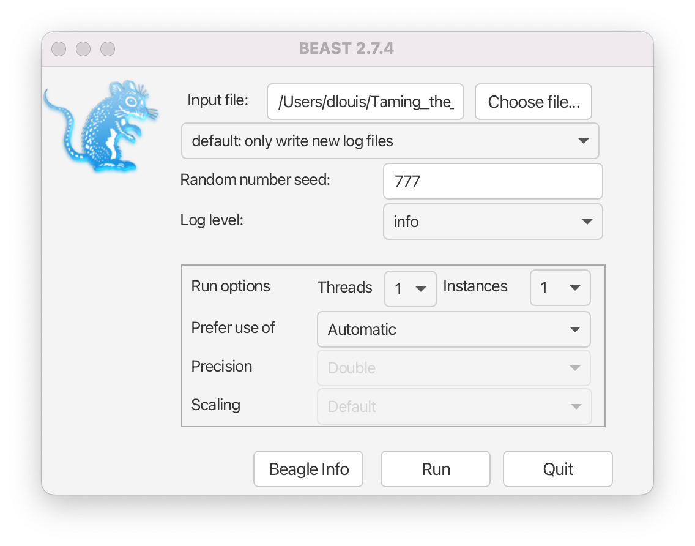
	<figcaption>Figure 11: BEAST2 setup for the analysis.</figcaption>
</figure>
 

The BEAST2 window should look as shown in [Figure 11](#fig:beast). 

> Run BEAST2 by clicking the `Run` button.

BEAST2 will run until the specified number of steps in the chain is reached. While it is running, it will print the screenlog values to a console and store the tracelog and tree log values to files located in the same folder as the configuration XML file. The screen output will look approximately as shown in [Figure 12](#fig:beast_out).

<figure>
	
	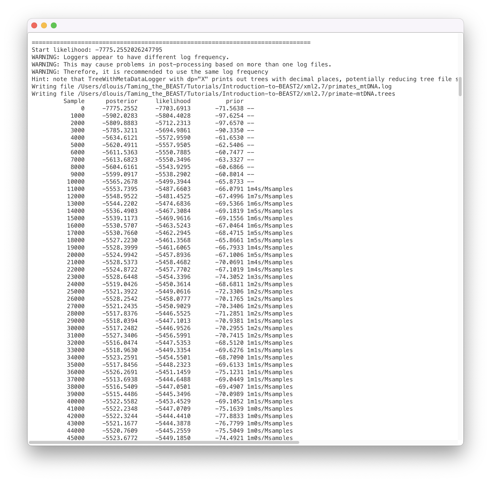
	<figcaption>Figure 12: BEAST2 output for the analysis.</figcaption>
</figure>
 

The window will remain open when BEAST2 will finished. When you try to close it, you may see BEAST2 asking the question: "Do you wish to save?". Note that your log and trees files are always saved, no matter what answer you choose for this question. Thus, the question is only restricted to saving or not of the BEAST2 screenlog output.

> **Topic for discussion:** While the analysis is running see if you can identify which parts of the setup in BEAUti are concerned with the data, the model and the MCMC algorithm. 
>
> Open the XML file in your favourite text editor. Can you recognize any of the values you set in BEAUti? Can you identify the data, model specification and MCMC settings in the XML file? 
>
> Can you find the likelihood, priors and hyperpriors in the XML file?
>

----

## Analysing the results

Once BEAST2 has finished running, open Tracer to get an overview of BEAST2 output. When the main window has opened, choose `File > Import Trace File...` and select the file called `primate-mtDNA.log` that BEAST2 has created, or simply drag the file from the file manager window into Tracer. 

> Open **Tracer**. Drag and drop the `primate-mtDNA.log` file that BEAST2 created into the open Tracer window.
> 
> Alternatively, use **File > Import Trace File...** (or press the **+** button below the **Trace Files** panel)
> then locate and click on `primate-mtDNA.log`.
>

The Tracer window should look as shown in [Figure 13](#fig:tracer_bad).

<figure>
	
	
	<figcaption>Figure 13: Tracer showing a summary of the BEAST2 run of primate data with MCMC chain length of 1'000'000.</figcaption>
</figure>
 

Tracer provides a few useful summary statistics on the results of the analysis. On the left side in the top window it provides a list of log files loaded into the program at the moment. The window below shows the list of statistics logged in each file. For each statistic it gives a list of summary values such as the mean, standard error, median, and others it can compute from the data. The summary values are displayed in the top right window and a histogrom showing the distribution of the statistic is in the bottom right window. 

The log file contains traces for the posterior (this is the natural logarithm of the product of the tree likelihood and the prior density), prior, the likelihood, tree likelihoods and other continuous parameters. Selecting a trace on the left brings up the summary statistics for this trace on the right hand side. When first opened, the **posterior** trace is selected and various statistics of this trace are shown under the **Estimates** tab.

For each loaded log file we can specify a **Burn-In**, which is shown in the file list table (top left) in Tracer. The burn-in is intended to give the Markov Chain time to reach its equilibrium distribution, particularly if it has started from a bad starting point. A bad starting point may lead to over-sampling regions of the posterior that actually have very low probability under the equilibrium distribution, before the chain settles into the equilibrium distribution. Burn-in allows us to simply discard the first _N_ samples of a chain and not use them to compute the summary statistics. Determining the number of samples to discard is not a trivial problem and depends on the size of the dataset, the complexity of the model and the length of the chain. A good rule of thumb is to always throw out at least the first 10% of the whole chain length as the burn-in (however, in some cases it may be necessary to discard as much as 50% of the MCMC chain).

Select the **TreeHeight** statistic in the left hand list to look at the tree height estimated jointly for all partitions in the alignment. Tracer will plots (marginal posterior) histogram for the selected statistic and also give you summary statistics such as the mean and median. The 95% HPD stands for *highest posterior density interval* and represents the most compact interval on the selected statistic that contains 95% of the posterior density. It can be loosely thought of as a Bayesian analogue to a confidence interval. The **TreeHeight** statistic gives the marginal posterior distribution of the age of the root of the entire tree (that is, the tMRCA).

> Select **TreeHeight** in the bottom left hand list in Tracer and view the different summary statistics on the right.

You can also compare estimates of different parameters in Tracer. Once a trace file is loaded into the program you can, for example, compare estimates of the different mutation rates corresponding to the different partitions in the alignment. 

> Select all four mutation rates by clicking the first mutation rate (**mutationRate.noncoding**), then holding **Shift** and clicking the last mutation rate (**mutationRate.3rdpos**).
>
> Select the **Marginal Density** tab on the right to view the four distributions together.
>
> Select different options in the **Display** drop-down menu to display the posterior distributions in different ways.

You will be able to see all four distributions in one plot, similar to what is shown in [Figure 14](#fig:tracer_comparison).

<figure>
	
	
	
	
	<figcaption>Figure 14: Tracer showing the four marginal probability distributions of the mutation rates in each partition of the alignment. The figure at the top shows the marginal distributions plotted with a Kernel Density Estimation (KDE) in the middle as violin plots and at the bottom as box and whisker plots.</figcaption>
</figure>
 

> **Topic for discussion:** What can you deduce from the marginal densities of the 4 mutation rates? Does this make biological sense?
>
> Why do you think the mutation rate of non-coding DNA is similar to the rates of 1st and 2nd codon positions?

### Analysing the posterior estimate quality

Two very important summary statistics that we should pay attention to are the Auto-Correlation Time (ACT) and the Effective Sample Size (ESS). ACT is the average number of states in the MCMC chain that two samples have to be separated by for them to be uncorrelated, i.e. for them to be independent samples from the posterior. The ACT is estimated from the samples in the trace (excluding the burn-in). The ESS is the number of independent samples that the trace is equivalent to. This is calculated as the chain length (excluding the burn-in) divided by the ACT.

The ESS is in general regarded as a quality-measure of the resulting sample sequence. It is unclear how to determine exactly how large should the ESS be for the analysis to be trustworthy. In general, an ESS of 200 is considered high enough to make the analysis useful. However, this is an arbitrary number and you should always use your own judgment to decide if the analysis has converged or not. As you can see in [Figure 13](#fig:tracer_bad), ESS values below 100 are coloured in red, which means that we should not trust the value of the statistics, and ESS values between 100 and 200 are coloured in yellow.

If a lot of statistics have red or yellow coloured ESS value, we have not sufficiently explored the posterior space. This is most likely a result of the chain not running long enough. Try running the same analysis as before, but with a longer chain. 

> First load the XML configuration file into BEAUti again by pressing **File > Load** and select the `Primates.xml` file.  Within BEAUti, change the MCMC chain length parameter to **10'000'000** and change the **tracelog** frequency to **1'000**. 
>
> Change the trace and tree log file names in order to not overwrite the results of the previous analysis. You may add something like `_long` behind the name of the file, to obtain `primate-mtDNA_long.log` for the log file and `primate-mtDNA_long.trees` for trees file. 
>
> Run BEAST2 again with the updated configuration file and the same seed of **777**. 

This will take a bit more time. [Figure 15](#fig:tracer_better) shows the estimates from a longer run. In this case all parameters have ESS values larger than 200. Remember that MCMC is a stochastic algorithm, so if you set a different seed the actual numbers will not be exactly the same as those depicted in the figure.

<figure>
	
	
	<figcaption>Figure 15: Tracer showing a summary of the BEAST2 run with MCMC chain length of 10'000'000.</figcaption>
</figure>
 

Tracer also allows us to look for correlations between parameters under the **Joint Marginal** tab, as shown in [Figure 16](#fig:tracer_joint). When two parameters are highly correlated this can lead to poor convergence of the MCMC chain (more on this in later tutorials). 

<figure>
	
	
	<figcaption>Figure 16: Correlation between the tree height and clock rate estimates.</figcaption>
</figure>
 

We can also look at correlations between more than two parameters.

> Select all 4 mutation rates again
> 
> - Navigate to the **Joint Marginal** tab
> - Check **Show points**

The panel should like [Figure 17](#fig:tracer_covariance). The ellipses represent the covariance between pairs of parameters and make it easy to identify which pairs are correlated or anti-correlated. Is there a strong correlation or anti-correlation between some of our mutation rate parameters?

<figure>
	
	
	<figcaption>Figure 17: Correlations between the mutation rate parameters.</figcaption>
</figure>
 

> **Topic for discussion:** We have not explored the **Trace** tab in Tracer at all!
>
> The **Trace** tab is primarily a diagnostic tool for checking convergence to the posterior, assessing the length of the burn-in and whether or not the chain is mixing well. There is a good argument to be made for this being the _most important_ tab in the Tracer program and that it is the first tab users should look at. 
> 
> Have a look at the individual parameter traces in the **Trace** tab, in both the short and long log files. Can you figure out why ESS values for some parameters are higher than others? 
> 
> Do you think a burn-in of 10% is sufficient for this analysis?
>

### Analysing tree estimates

Besides producing a sample of parameter estimates, BEAST2 also produces a posterior sample of phylogenetic time-trees. These need to be summarised too before any conclusions about the quality of the posterior estimate can be made.

One way to summarise the trees is by using the program TreeAnnotator. This will take the set of trees and find the best supported tree. It will then annotate this representative summary tree with the mean ages of all the nodes and the corresponding 95% HPD ranges. It will also calculate the posterior clade probability for each node. Such a tree is called the _maximum clade credibility_ tree.

> Open **TreeAnnotator**.
> 
> Set the **Burnin percentage** to **10%** to discard the first 10% of trees in the log file.

The next option, the **Posterior probability limit**, specifies a limit such that if a node is found at less than this frequency in the sample of trees (i.e. has a posterior probability less than this limit), it will not be annotated. For example, setting it to 0.5 means that only nodes seen in the majority (more than 50%) of trees will be annotated. The default value is 0, which we will leave as is, and which means that TreeAnnotator will annotate all nodes.

> Leave the **Posterior probability limit** at the default value of **0**.

For the **Target tree type** option you can either choose a specific tree from a file or ask TreeAnnotator to find a tree in your sample. The default option which we will leave, **Maximum clade credibility tree**, finds the tree with the highest product of the posterior probability of all its nodes.

> Leave the **Target tree type** at the default value of **Maximum clade credibility tree**.

Next, select **Mean heights** for the **Node heights**. This sets the heights (ages) of each node in the tree to the mean height across the entire sample of trees for that clade.

> Select **Mean heights** in the **Node heights** drop-down menu.

Finally, we have to select the input tree log file and set an output file. 

> Click **Choose File** next to **Input Tree File** and choose `primate-mtDNA.trees`.
>
> Set the **Output File** to `Primates.MCC.tree`.

The setup should look as shown in [Figure 18](#fig:treeannot). You can now run the program.

<figure>
	
	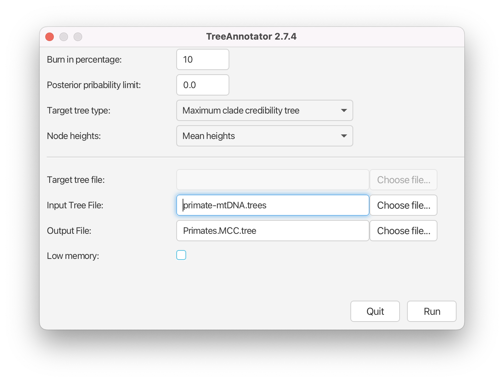
	<figcaption>Figure 18: TreeAnnotator setup</figcaption>
</figure>
 

### Visualising the tree estimate

Finally, we can visualize the tree with one of the available pieces of software, such as FigTree.

> Open **FigTree**. Use **File > Open** then locate and click on `Primates.MCC.tree`.
>
> - Expand **Trees** options, check **Order nodes** and select **decreasing** from the drop-down menu.
> - Expand the **Tip Labels** options and increase the **Font Size** until it is readable. 
> - Check the **Node Bars** checkbox, expand the options and select `height_95%_HPD` from the **Display** drop-down menu.
> - Check the **Node Labels** checkbox, expand the options and select `posterior` from the **Display** drop-down menu.
> - Increase the **Font Size** until it is readable.
> - Uncheck the **Scale Bar** checkbox.
> - Check the **Scale Axis** checkbox, expand the options, check **Reverse axis** and increase the **Font Size**.
>

<figure>
	
	
	<figcaption>Figure 19: FigTree visualisation of the estimated tree.</figcaption>
</figure>
 

Your tree should now look something like [Figure 19](#fig:figtree). We first ordered the tree nodes. Because there are many ways to draw the same tree ordering nodes makes it easier for us to compare different trees to each other. The scale bars we added represent the 95% HPD interval for the age of each node in the tree, as estimated by the BEAST2 analysis. The node labels we added gives the posterior probability for a node in the posterior set of trees (that is, the trees logged in the tree log file, after discarding the burn-in). We can also use FigTree to display other statistics, such as the branch lengths, the 95% HPD interval of a node etc. The exact statistics available will depend on the model used.

> **Topics for discussion:** The posterior probabilities tell us which clades are highly supported and the scale bars tell us how confident we are about their divergence times. 
>
> - Are all clades well-supported? How about their ages?
> - Look at the 95% HPD interval for the age of the apes (_Hylobates, Pongo, Gorilla, Pan_ and _Homo sapiens_). Does the estimated age agree with your prior knowledge?
> - What about the divergence time between old-world and new-world monkeys? (_Saimiri sciureus_ is the only new-world monkey in this dataset).

### Visualising tree posteriors (optional)

The MCC tree is one way of summarising the posterior distribution of trees as a single tree, annotated with extra information on some nodes to represent the uncertainty in the tree estimates. Just as summarising the posterior distributions of a continuous parameter as a median and confidence interval throws away a lot of information (such as the shape of the distribution) a lot of information is lost when summarising a set of trees as an MCC tree. However, it is significantly more difficult to visualise the set of posterior trees.

One possibility is to use the program **DensiTree**. DensiTree does not need a summary tree (so we do not need to run TreeAnnotator prior to using DensiTree) to be able to visualise the estimates. 

> Open **DensiTree**. Use **File > Load** then locate and click on `primate-mtDNA.trees`.
> 
> Expand the **Show** options and check the **Consensus Trees** checkbox.
> 

You should now see many lines corresponding to all the individual trees samples by your MCMC chain. You can also clearly see a pattern across all of the posterior trees. 

> In order to see the support for the topology, select the **Central** view mode. 
>
> Now expand the **Clades** menu, check the **Show clades** checkbox and the **text** checkbox for the **Support**. 

The tree should look as shown in [Figure 20](#fig:densitree).

<figure>
	
	
	<figcaption>Figure 20: DensiTree visualisation of the tree sample.</figcaption>
</figure>
 

You can also view all of the different clades and their posterior probabilities by selecting **Help > View clades**. In this particular run there is little uncertainty in the tree estimate with respect to clade grouping, as almost every clade has 100% support.

> **Topics for discussion:** The Yule model for speciation has one parameter (**birthRateY.t:tree**), representing the speciation rate. This model assumes that there is no extinction and thus that all taxa are sampled.
>
> - What are the units for **birthRateY.t:tree**? From your analysis, can you figure out, on average, how many years have to elapse before a new species is formed? (Have a look at the tracelog).
> - Is the Yule model an appropriate model to use here?
> - In the dataset there is a much larger sampling proportion for the great apes (4/8 extant species) than for lemurs, tarsiers and new-world monkeys (one species each). Do you think unequal sampling proportions are an issue?
> 

----

# Acknowledgment

The content of this tutorial is based on the [Divergence Dating Tutorial with BEAST 2.0](https://github.com/CompEvol/beast2/blob/master/doc/tutorials/DivergenceDating/DivergenceDatingTutorialv2.0.3.pdf?raw=true) tutorial by Drummond, Rambaut, and Bouckaert.

# Useful Links

- [Bayesian Evolutionary Analysis with BEAST 2](http://www.beast2.org/book.html)
- BEAST 2 website and documentation: [http://www.beast2.org/](http://www.beast2.org/)
- BEAST 1 website and documentation: [http://beast.bio.ed.ac.uk](http://beast.bio.ed.ac.uk)
- Join the BEAST user discussion: [http://groups.google.com/group/beast-users](http://groups.google.com/group/beast-users) 

---- 

# Relevant References



